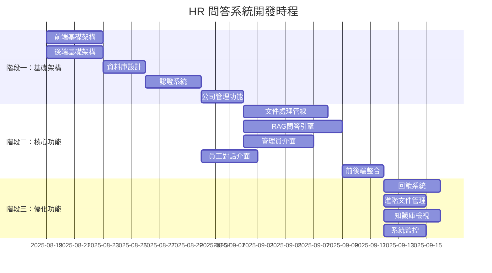

# HR 內部問答系統 - 實施計劃

## 專案概述

本文件定義了 HR 內部問答系統的完整實施計劃，包括功能拆解、平行處理策略、實施順序和里程碑管理。

**專案目標：**
- 建立 AI 驅動的 HR 問答系統
- 實現多租戶資料隔離
- 提供高效的知識庫管理介面
- 確保 98% 的回答準確度

**技術棧：**
- 前端：React + TypeScript + MUI + Zustand
- 後端：Python + FastAPI + SQLAlchemy
- 資料庫：PostgreSQL + PGVector
- AI：RAG + LLM Integration

---

## 第一階段：基礎架構建立 (週 1-2)

### 目標
建立專案骨幹和核心基礎設施，實現管理員基礎功能。

### 可平行處理的工作包

#### 工作包 1.A：前端基礎架構 (並行)
**負責範圍：** 前端開發環境和基礎 UI 框架
- [ ] **1.A.1** 建立 Monorepo 結構
- [ ] **1.A.2** 設定 React + TypeScript + Vite 開發環境
- [ ] **1.A.3** 集成 MUI 和 Zustand
- [ ] **1.A.4** 設定 ESLint + Prettier
- [ ] **1.A.5** 建立基礎路由結構 (`/admin/*`, `/chat`, `/login`)
- [ ] **1.A.6** 創建基礎 UI 元件 (Layout, Header, Button, Input)

**預估時間：** 3-4 天
**依賴：** 無

#### 工作包 1.B：後端基礎架構 (並行)
**負責範圍：** 後端開發環境和 API 框架
- [ ] **1.B.1** 設定 FastAPI 專案結構
- [ ] **1.B.2** 設定 SQLAlchemy 和 Alembic
- [ ] **1.B.3** 建立 PostgreSQL 連線
- [ ] **1.B.4** 設定開發環境 (Docker Compose)
- [ ] **1.B.5** 建立基礎 API 路由結構
- [ ] **1.B.6** 設定測試環境 (Pytest)

**預估時間：** 3-4 天
**依賴：** 無

#### 工作包 1.C：資料庫設計與模型 (依賴 1.B)
**負責範圍：** 核心資料模型和多租戶架構
- [ ] **1.C.1** 建立核心資料表 (companies, admins, users)
- [ ] **1.C.2** 設定 PGVector 擴展
- [ ] **1.C.3** 建立知識庫相關表 (knowledge_documents, document_chunks)
- [ ] **1.C.4** 建立 SQLAlchemy 模型
- [ ] **1.C.5** 實作多租戶隔離基礎
- [ ] **1.C.6** 建立測試資料 Fixtures

**預估時間：** 2-3 天
**依賴：** 1.B.2, 1.B.3

#### 工作包 1.D：認證系統 (依賴 1.B, 1.C)
**負責範圍：** 管理員和員工認證機制
- [ ] **1.D.1** 實作 JWT 認證邏輯
- [ ] **1.D.2** 建立管理員登入 API
- [ ] **1.D.3** 建立員工登入 API
- [ ] **1.D.4** 實作權限保護中介軟體
- [ ] **1.D.5** 建立登入頁面 UI
- [ ] **1.D.6** 實作前端認證狀態管理

**預估時間：** 3-4 天
**依賴：** 1.B.5, 1.C.4

#### 工作包 1.E：公司管理功能 (依賴 1.D)
**負責範圍：** 多租戶公司管理
- [ ] **1.E.1** 建立公司 CRUD API
- [ ] **1.E.2** 實作公司列表頁面
- [ ] **1.E.3** 實作新增公司功能
- [ ] **1.E.4** 建立管理員儀表板基礎
- [ ] **1.E.5** 實作錯誤處理和驗證

**預估時間：** 2-3 天
**依賴：** 1.D.2, 1.D.4, 1.D.6

### 階段一里程碑
✅ **M1.1：開發環境就緒**
- 前後端開發伺服器可正常啟動
- 資料庫連線和基礎表建立完成
- 基礎 UI 框架搭建完成

✅ **M1.2：認證系統可用**
- 管理員可以成功登入
- JWT 認證機制正常運作
- 保護路由功能正常

✅ **M1.3：基礎多租戶功能**
- 管理員可以新增和查看公司
- 多租戶資料隔離基礎確立
- 管理員儀表板基本可用

---

## 第二階段：核心問答功能 (週 3-5)

### 目標
實現端到端的問答流程，包括文件處理、RAG 系統和對話介面。

### 可平行處理的工作包

#### 工作包 2.A：文件處理管線 (核心功能)
**負責範圍：** 文件上傳、解析和向量化
- [ ] **2.A.1** 建立文件上傳 API
- [ ] **2.A.2** 實作多格式文件解析 (.pdf, .docx, .txt)
- [ ] **2.A.3** 實作文本切割邏輯
- [ ] **2.A.4** 整合 Embedding 模型 (Sentence Transformers)
- [ ] **2.A.5** 實作向量資料存儲到 PGVector
- [ ] **2.A.6** 建立檔案處理狀態管理
- [ ] **2.A.7** 實作非同步處理隊列

**預估時間：** 5-6 天
**依賴：** 1.C.1, 1.C.2, 1.D.4

#### 工作包 2.B：RAG 問答引擎 (核心功能)
**負責範圍：** 問題理解、相似度搜尋和答案生成
- [ ] **2.B.1** 建立問題向量化邏輯
- [ ] **2.B.2** 實作向量相似度搜尋 (多租戶安全)
- [ ] **2.B.3** 整合 LLM API (OpenAI/Anthropic)
- [ ] **2.B.4** 建立 Prompt 範本系統
- [ ] **2.B.5** 實作問答 API 端點
- [ ] **2.B.6** 建立回答品質評估機制
- [ ] **2.B.7** 實作錯誤處理和降級策略

**預估時間：** 6-7 天
**依賴：** 1.C.2, 1.D.4

#### 工作包 2.C：管理員文件管理介面 (並行)
**負責範圍：** 文件管理的使用者介面
- [ ] **2.C.1** 建立文件列表頁面
- [ ] **2.C.2** 實作文件上傳介面
- [ ] **2.C.3** 建立處理狀態顯示
- [ ] **2.C.4** 實作檔案刪除功能
- [ ] **2.C.5** 建立檔案詳情檢視
- [ ] **2.C.6** 實作拖拽上傳功能

**預估時間：** 4-5 天
**依賴：** 1.A.6, 1.E.4, 2.A.1

#### 工作包 2.D：員工對話介面 (並行)
**負責範圍：** 員工端問答介面
- [ ] **2.D.1** 建立員工登入頁面
- [ ] **2.D.2** 實作對話介面 UI
- [ ] **2.D.3** 建立訊息歷史顯示
- [ ] **2.D.4** 實作即時打字指示器
- [ ] **2.D.5** 建立錯誤處理 UI
- [ ] **2.D.6** 實作回應等待動畫

**預估時間：** 3-4 天
**依賴：** 1.A.6, 1.D.3, 1.D.6

#### 工作包 2.E：前後端整合 (依賴所有)
**負責範圍：** 端到端流程串接
- [ ] **2.E.1** 串接文件上傳前後端
- [ ] **2.E.2** 串接問答對話前後端
- [ ] **2.E.3** 實作即時狀態更新
- [ ] **2.E.4** 建立錯誤處理機制
- [ ] **2.E.5** 實作載入狀態管理
- [ ] **2.E.6** 進行端到端測試

**預估時間：** 2-3 天
**依賴：** 2.A.1, 2.B.5, 2.C.2, 2.D.2

### 階段二里程碑
✅ **M2.1：文件處理系統**
- 管理員可以上傳各種格式文件
- 文件自動解析和向量化
- 處理狀態正確顯示

✅ **M2.2：問答系統核心**
- RAG 問答引擎正常運作
- 向量相似度搜尋準確
- LLM 整合成功

✅ **M2.3：端到端問答流程**
- 員工可以成功提問
- 系統回傳基於知識庫的答案
- 對話介面體驗良好

---

## 第三階段：管理與優化功能 (週 6-7)

### 目標
完善管理功能，建立回饋循環和系統監控能力。

### 可平行處理的工作包

#### 工作包 3.A：回饋系統 (並行)
**負責範圍：** 使用者回饋收集和分析
- [ ] **3.A.1** 建立回饋資料模型
- [ ] **3.A.2** 實作回饋收集 API
- [ ] **3.A.3** 在對話介面加入回饋按鈕
- [ ] **3.A.4** 建立回饋儀表板頁面
- [ ] **3.A.5** 實作回饋篩選和搜尋
- [ ] **3.A.6** 建立回饋統計分析

**預估時間：** 3-4 天
**依賴：** 2.D.2, 2.B.5

#### 工作包 3.B：進階文件管理 (並行)
**負責範圍：** 文件刪除和進階管理功能
- [ ] **3.B.1** 實作文件刪除 API (級聯刪除向量)
- [ ] **3.B.2** 建立刪除確認對話框
- [ ] **3.B.3** 實作批量操作功能
- [ ] **3.B.4** 建立文件版本控制
- [ ] **3.B.5** 實作文件標籤和分類

**預估時間：** 2-3 天
**依賴：** 2.A.5, 2.C.1

#### 工作包 3.C：知識庫檢視系統 (並行)
**負責範圍：** 向量資料庫內容檢視
- [ ] **3.C.1** 建立知識片段列表 API
- [ ] **3.C.2** 實作知識片段檢視頁面
- [ ] **3.C.3** 建立搜尋和篩選功能
- [ ] **3.C.4** 實作分頁和排序
- [ ] **3.C.5** 建立來源文件關聯顯示
- [ ] **3.C.6** 實作知識片段內容預覽

**預估時間：** 3-4 天
**依賴：** 2.A.5, 1.E.4

#### 工作包 3.D：系統監控和分析 (並行)
**負責範圍：** 系統效能監控和分析報告
- [ ] **3.D.1** 建立系統健康檢查 API
- [ ] **3.D.2** 實作使用量統計
- [ ] **3.D.3** 建立效能監控儀表板
- [ ] **3.D.4** 實作錯誤日誌收集
- [ ] **3.D.5** 建立自動化測試覆蓋率報告

**預估時間：** 2-3 天
**依賴：** 2.B.5, 1.E.4

### 階段三里程碑
✅ **M3.1：完整回饋循環**
- 員工可以對答案提供回饋
- 管理員可以檢視和分析回饋
- 回饋數據用於系統優化

✅ **M3.2：完善的知識庫管理**
- 文件的完整生命週期管理
- 知識片段的詳細檢視
- 進階的搜尋和分析功能

✅ **M3.3：系統監控和分析**
- 系統效能監控就緒
- 使用量和品質分析可用
- 基礎的自動化測試覆蓋

---

## 平行處理策略

### 團隊分工建議

### 技能需求分配

**前端開發人員：**
- 工作包 1.A (前端基礎架構)
- 工作包 2.C (管理員文件管理介面) 
- 工作包 2.D (員工對話介面)
- 工作包 3.A.3 (回饋介面)

**後端開發人員：**
- 工作包 1.B (後端基礎架構)
- 工作包 1.C (資料庫設計)
- 工作包 1.D (認證系統)
- 工作包 2.A (文件處理管線)

**AI/ML 工程師：**
- 工作包 2.B (RAG 問答引擎)
- 工作包 3.A.6 (回饋分析)
- 工作包 3.D.5 (效能優化)

**全端開發人員：**
- 工作包 1.E (公司管理功能)
- 工作包 2.E (前後端整合)
- 工作包 3.B (進階文件管理)
- 工作包 3.C (知識庫檢視)

---

## 風險管理

### 關鍵路徑風險
1. **RAG 問答引擎 (工作包 2.B)** - 核心功能，延遲影響整體進度
2. **多租戶隔離 (工作包 1.C)** - 安全基礎，必須確保正確實作
3. **LLM API 整合** - 第三方依賴，需要備案

### 緩解策略
- **技術風險**：為關鍵工作包分配最有經驗的開發人員
- **依賴風險**：提前測試第三方服務整合
- **進度風險**：保持每日站會和週進度檢查
- **品質風險**：每個工作包都需要 code review 和測試

---

## 測試策略

### 測試類型和責任
- **單元測試**：每個工作包交付時必須包含 >80% 覆蓋率
- **整合測試**：跨工作包功能的測試，特別是認證和資料隔離
- **端到端測試**：核心用戶流程的自動化測試
- **效能測試**：RAG 問答引擎的回應時間測試
- **安全測試**：多租戶隔離的滲透測試

### 測試里程碑
- 每個工作包完成後：單元測試通過
- 每個階段完成後：整合測試通過  
- 專案完成前：端到端測試和效能測試通過

---

## 交付物檢查清單

### 階段一交付物
- [ ] 可運行的開發環境 (前端 + 後端)
- [ ] 基礎資料模型和 API 文件
- [ ] 管理員登入和公司管理功能
- [ ] 多租戶隔離基礎實作
- [ ] 基礎測試覆蓋率報告

### 階段二交付物  
- [ ] 完整的文件處理管線
- [ ] 可用的 RAG 問答引擎
- [ ] 員工和管理員完整 UI
- [ ] 端到端問答流程
- [ ] API 文件和使用手冊

### 階段三交付物
- [ ] 回饋系統和分析儀表板
- [ ] 進階文件管理功能
- [ ] 知識庫檢視和搜尋
- [ ] 系統監控和日誌
- [ ] 完整的測試和文件

### 最終交付物
- [ ] 完整可部署的應用程式
- [ ] 完整的 API 文件
- [ ] 使用者操作手冊
- [ ] 系統管理員指南
- [ ] 測試報告和效能基準
- [ ] 源碼和部署腳本

---

## 後續擴展規劃

### 短期優化 (第四階段)
- 進階權限管理系統
- 多語言支援
- 進階分析和報告功能
- 行動裝置響應式設計

### 中期發展 (第五階段)  
- 微服務架構重構
- 雲端部署和 CI/CD
- 進階 AI 功能 (對話記憶、個人化推薦)
- API 開放平台

### 長期願景
- 多模態支援 (語音、圖像)
- 智慧知識圖譜
- 企業級安全和合規
- 國際化和本地化

---

## Auth Smoke Test (Manual)

- [ ] Backend: start FastAPI on 8000 (or via Docker)
  - [ ] Local: uvicorn app.main:app --reload --port 8000 (run in apps/backend)
  - [ ] Or: docker-compose up backend -d
- [ ] Frontend (dev): leave VITE_API_BASE_URL unset to use proxy; run in apps/frontend
  - [ ] npm install
  - [ ] npm run dev
- [ ] Admin flow
  - [ ] Navigate to /login → Admin tab → login with valid admin
  - [ ] Visit Companies page → verify 200 and data loads (Authorization header present)
  - [ ] Refresh page → auth persists (persisted Zustand store)
- [ ] User flow
  - [ ] Navigate to /login → Employee tab → login using employee_id
  - [ ] Open Chat → ask a question → verify answer returns
  - [ ] Refresh page → auth persists
- [ ] 401 handling
  - [ ] Clear localStorage key "auth-storage" manually
  - [ ] Trigger any protected API call → app auto-logs out and redirects to /login
- [ ] Production behavior
  - [ ] Set VITE_API_BASE_URL to your API origin (e.g., https://api.example.com)
  - [ ] Build: npm run build; Serve the dist
  - [ ] Confirm no mock-auth on failures in production (fallback gated to dev only)

## Security and Auth Notes (Next Steps)

- [ ] Employee login: add a secret (PIN/OTP/SSO), enable rate limiting, and audit logging
- [ ] Consider adding /api/v1/me and populate user from server instead of client-side JWT decode
- [ ] OAuth2PasswordBearer: either implement a proper /token flow or document/remove placeholder usage
- [ ] Cleanup: remove deprecated authStore-simple.ts once all branches are merged and verified
