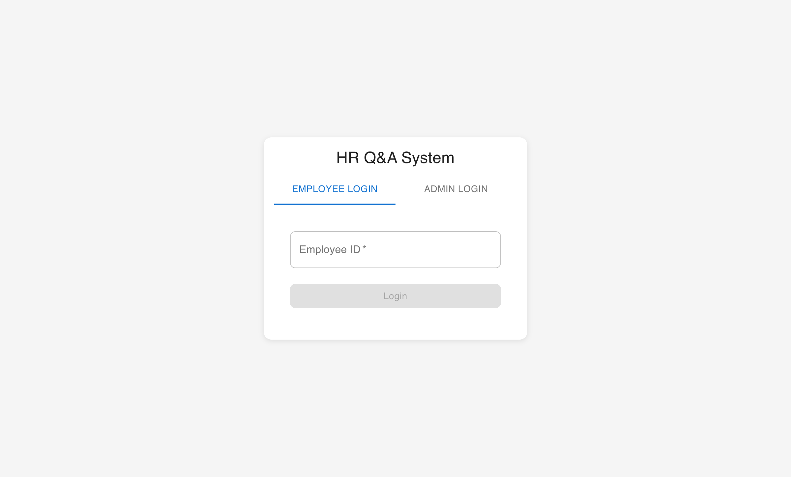
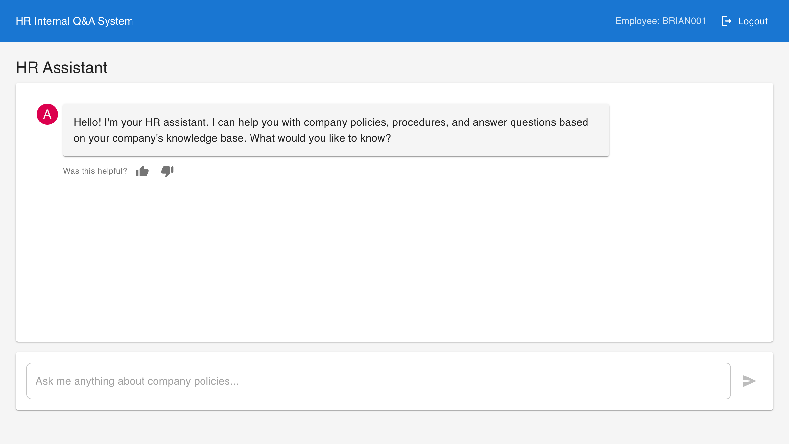
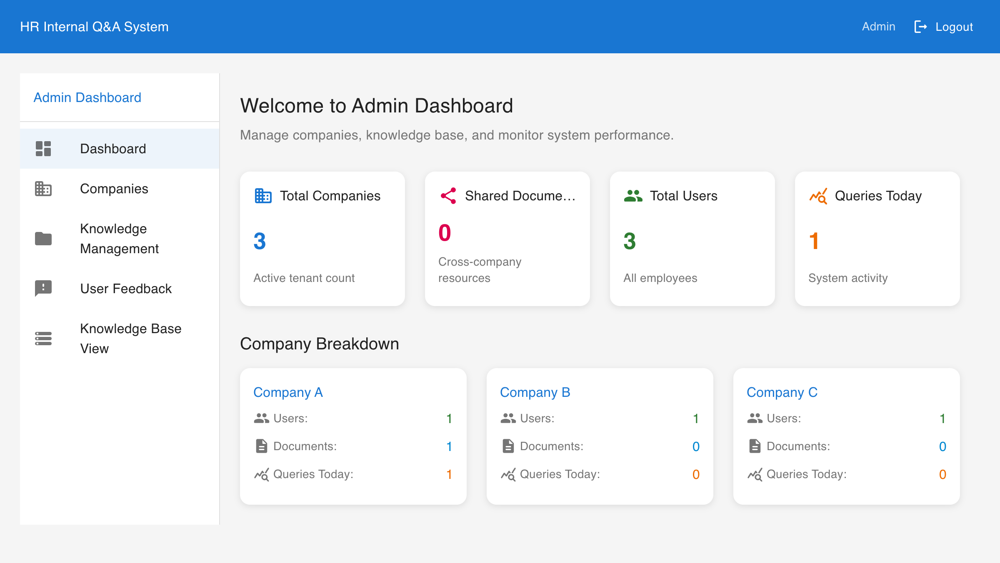
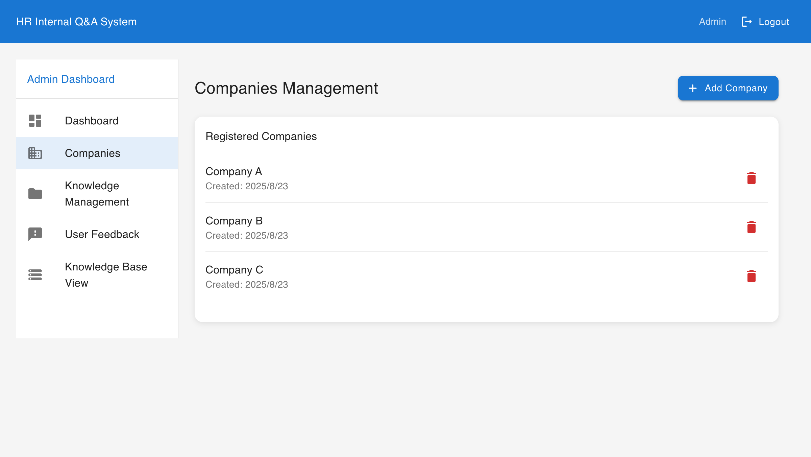
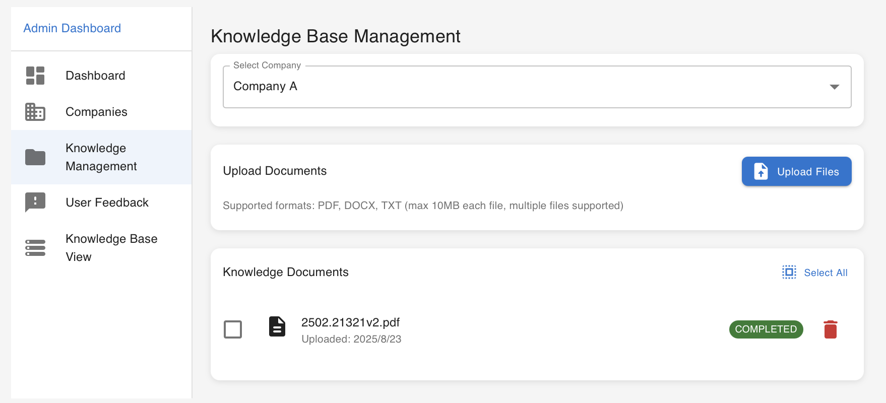
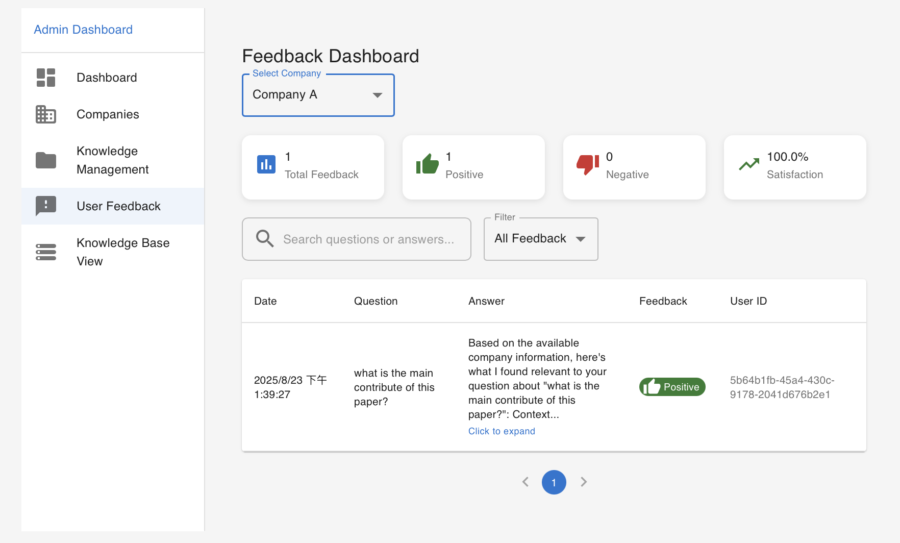

# Enterprise RAG System 🤖

A comprehensive multi-tenant RAG-powered (Retrieval-Augmented Generation) enterprise system built for intelligent document management, natural language query capabilities, and company-scoped knowledge base interactions.

[](https://reactjs.org/)
[](https://fastapi.tiangolo.com/)
[](https://www.postgresql.org/)
[](https://openrouter.ai/)

## ✨ Features

### 🔐 Multi-Tenant Authentication & User Management
- **Admin Dashboard**: Complete system administration with full CRUD operations
- **User Management**: Create, update, and manage users with names and company assignments
- **Employee Access**: Company-scoped access with secure employee ID authentication
- **Role-Based Permissions**: Granular access control for admins and employees
- **Company Isolation**: Strict data separation ensuring no cross-company data leakage

### 📚 Advanced Knowledge Management System
- **Multi-Format Support**: PDF, DOCX, TXT document processing with enhanced workflow
- **Shared Document System**: Documents can be company-specific or shared across all companies (共同)
- **Two-Phase Processing**: Upload documents first, then configure chunk parameters via interactive dialog
- **Custom Chunking**: Admin-configurable chunk size and overlap length for optimal performance
- **Processing Status Tracking**: Real-time status updates (PENDING → PROCESSING → COMPLETED)
- **Visual Indicators**: Clear UI distinction between shared and private documents with color coding
- **Advanced Pagination**: Sort by upload date with efficient pagination for large document sets
- **Version Control**: Document versioning with comprehensive metadata management

### 🤖 Company-Scoped RAG System
- **Intelligent Query Routing**: Automatic filtering of responses based on user's company + shared documents
- **Dynamic Model Management**: Admin can add/remove OpenRouter models and set defaults dynamically
- **Multi-Model Support**: Support for multiple LLM models with easy switching
- **Enhanced Context Building**: Smart context assembly from company-relevant documents only
- **Semantic Search with Isolation**: PGVector-powered similarity search respects company boundaries
- **Graceful Fallbacks**: Intelligent error handling when no relevant documents are found
- **Feedback Loop**: User feedback collection for continuous system improvement

### 🏢 Enterprise-Grade Architecture & Security
- **Complete Multi-Tenant Isolation**: Database-level data separation with company-scoped queries
- **Enhanced Security Model**: JWT authentication with company context and role verification
- **Data Protection**: Users can only access their company's documents + explicitly shared content
- **Scalable Design**: Clean separation between API routes, business logic, and data access
- **Comprehensive Testing**: 46 unit tests covering all functionality with >90% coverage
- **Production Ready**: Advanced logging, error handling, monitoring, and performance optimization

## 🚀 Two Ways to Deploy

### Method 1: Build from Source Code (Development)

#### Prerequisites
- Docker & Docker Compose installed
- Git installed
- 8GB+ RAM recommended

#### Quick Start
```bash
# Clone repository
git clone <your-github-repo-url>
cd rag-enterprise-system

# Set up environment variables
cp .env.production .env
# Edit .env with your API keys and passwords

# Build and deploy
docker-compose -f docker-compose.production.yml up -d --build

# Initialize database
docker-compose -f docker-compose.production.yml exec backend python -m alembic upgrade head
docker-compose -f docker-compose.production.yml exec -T postgres psql -U postgres -d hr_chatbot < create-dev-data.sql
```

### Method 2: Use Pre-built Images (Quick Deployment)

#### For Docker Hub Images
```bash
# Create project directory
mkdir rag-enterprise-system && cd rag-enterprise-system

# Download deployment files
wget https://raw.githubusercontent.com/<username>/<repo>/main/docker-compose.production.yml
wget https://raw.githubusercontent.com/<username>/<repo>/main/create-dev-data.sql
wget https://raw.githubusercontent.com/<username>/<repo>/main/.env.production

# Configure environment
cp .env.production .env
# Edit .env with your settings

# Deploy with pre-built images
docker-compose -f docker-compose.production.yml up -d

# Initialize database
docker-compose -f docker-compose.production.yml exec backend python -m alembic upgrade head
docker-compose -f docker-compose.production.yml exec -T postgres psql -U postgres -d hr_chatbot < create-dev-data.sql
```

## 🌐 Access Points

- **Frontend**: http://localhost:4000
- **Backend API**: http://localhost:9000
- **API Docs**: http://localhost:9000/docs

## 👤 Default Accounts

### Admin Account
- Email: `admin@dev.com`
- Password: `admin123`

### Employee Accounts (ID only, no password)
- `BRIAN001` (Brian Zhang - Acme Corp)
- `TONY001` (Tony Chen - Acme Corp)  
- `LISA001` (Lisa Wang - Tech Innovations Inc)
- `DEV001` (Developer User - Tech Innovations Inc)

## ⚠️ Production Security

**IMPORTANT**: Change default passwords before production:

```sql
-- Update admin password
UPDATE admins SET password_hash = 'your_bcrypt_hash' WHERE email = 'admin@dev.com';

-- Remove test accounts
DELETE FROM users WHERE employee_id IN ('BRIAN001', 'TONY001', 'LISA001', 'DEV001');
```

## 🔧 Management Commands

```bash
# View logs
docker-compose -f docker-compose.production.yml logs -f

# Stop services
docker-compose -f docker-compose.production.yml down

# Restart service
docker-compose -f docker-compose.production.yml restart backend

# Database access
docker-compose -f docker-compose.production.yml exec postgres psql -U postgres -d hr_chatbot
```

## 🐛 Troubleshooting

### Common Issues:

1. **Port Conflicts**
```bash
lsof -i :4000 -i :5433 -i :6380 -i :9000
```

2. **Services Not Healthy**
```bash
docker-compose -f docker-compose.production.yml logs backend
```

3. **Database Issues**
```bash
docker-compose -f docker-compose.production.yml exec postgres pg_isready -U postgres
```

## 📸 Screenshots & Interface

### 🔐 Login Interface

The system provides separate login paths for employees and administrators with a clean, intuitive interface.



*Clean dual-tab login interface supporting both employee ID authentication and admin email/password login*

### 👩‍💻 Employee Interface

#### Main Chat Interface


*Company-scoped HR assistant interface with clean Material-UI design and user context display*


**Key Employee Features:**
- **Simple Employee ID Login** - No passwords required for streamlined employee access
- **Company Context Display** - Clear indication of which employee and company is logged in
- **Intelligent Chat Interface** - Natural language queries with AI-powered responses
- **Conversation History** - Maintains chat history with clear user/assistant distinction
- **Feedback System** - Thumbs up/down feedback for continuous improvement
- **Responsive Design** - Works seamlessly across desktop, tablet, and mobile devices

### 👨‍💼 Admin Interface

#### Admin Dashboard Overview


*Comprehensive admin dashboard with real-time metrics, company breakdowns, and system monitoring*

#### Company Management


*Full CRUD operations for company management with creation dates and bulk operations*

#### Knowledge Base Management


*Document upload, processing workflow, and knowledge base management with company-scoped control*

#### User Feedback Dashboard


*Company-scoped feedback monitoring and quality assurance with filtering capabilities*

**Key Admin Features:**
- **Real-time Metrics Dashboard** - Live statistics on companies, users, documents, and query activity
- **Multi-Tenant Management** - Complete control over companies, users, and data isolation
- **Knowledge Base Control** - Upload, process, and manage documents with shared/private settings
- **System Monitoring** - Track user activity, feedback, and system performance
- **Responsive Admin UI** - Clean navigation with comprehensive functionality across all devices

### 🏢 Multi-Tenant Architecture in Action

The interface demonstrates complete **multi-tenant data isolation**:

1. **Employee View**: Users like `BRIAN001` see only their company's data plus shared resources
2. **Admin View**: Full system visibility with company-breakdown analytics
3. **Secure Context**: All interfaces respect company boundaries automatically
4. **Shared Resources**: Documents marked as "共同" are accessible across companies
5. **Role-Based UI**: Different interfaces and capabilities based on user role and company

### 🎨 Design System

**Material-UI Components:**
- Consistent color scheme and typography
- Responsive grid layouts and card-based design
- Intuitive navigation with clear visual hierarchy
- Accessible form controls and interactive elements
- Professional dashboard layouts with data visualization

## 💻 Development Setup (Optional)

For local development with hot reloading:

### Prerequisites
- Node.js >= 20.0.0 and npm >= 10.0.0
- Python 3.9+ (conda environment recommended)

### Quick Development Setup
```bash
# Clone and setup
git clone <your-repo-url>
cd rag-enterprise-system

# Setup environment
cp .env.example .env
# Edit .env with your OpenRouter API key

# Start database services
docker-compose up -d postgres redis

# Setup backend
cd apps/backend
conda create -n rag-system python=3.11
conda activate rag-system
pip install -r requirements.txt
python -m alembic upgrade head

# Setup frontend
cd ../frontend
npm install
cd ../..

# Initialize database
docker-compose exec -T postgres psql -U postgres -d hr_chatbot < create-dev-data.sql

# Start development
npm run dev
```

**Development Access:**
- Frontend: http://localhost:3000
- Backend: http://localhost:8000/docs

## 🔧 Required Environment Variables

```bash
# Required: OpenRouter API Key (free at openrouter.ai)
OPENROUTER_API_KEY=your-openrouter-api-key-here

# Optional: Customize AI model
LLM_MODEL=microsoft/phi-3-mini-128k-instruct:free

# Security (change in production)
SECRET_KEY=your-very-long-secret-key-here
POSTGRES_PASSWORD=your_postgres_password
REDIS_PASSWORD=your_redis_password
```

## 🛠 Development Commands

### Root Level Commands
```bash
# Development
npm run dev              # Start both frontend and backend
npm run dev:frontend     # Start frontend only (port 3000)  
npm run dev:backend      # Start backend only (port 8000)

# Building
npm run build            # Build frontend for production
npm run build:frontend   # Build frontend specifically

# Testing
npm run test             # Run all tests
npm run test:frontend    # Run frontend tests
npm run test:backend     # Run backend tests

# Code Quality
npm run lint             # Lint all code
npm run lint:frontend    # Lint frontend code
npm run lint:backend     # Lint backend code
npm run format           # Format all code
npm run format:frontend  # Format frontend code
npm run format:backend   # Format backend code
```

### Backend Commands (from apps/backend/)
```bash
# Database migrations
python -m alembic upgrade head                    # Apply migrations
python -m alembic revision --autogenerate -m "description"  # Create migration

# Testing
python -m pytest                                 # Run all tests
python -m pytest tests/test_specific.py         # Run specific test
python -m pytest --cov=app tests/               # Run tests with coverage

# Code quality
black .                                          # Format code
ruff check .                                    # Lint code  
ruff check . --fix                              # Fix linting issues
mypy .                                          # Type checking
```

## 🏗 Architecture Overview

### Technology Stack

**Frontend Stack:**
- **React 18** with TypeScript for type safety
- **Vite** for fast development and building
- **Material-UI (MUI)** for consistent, accessible UI components
- **Zustand** for lightweight state management
- **React Router** for client-side routing

**Backend Stack:**
- **FastAPI** with automatic OpenAPI documentation
- **SQLAlchemy** ORM with PostgreSQL database
- **Alembic** for database migrations
- **Pydantic** for data validation and serialization
- **JWT** authentication with role-based access

**AI/ML Stack:**
- **OpenRouter API** for LLM integration (free models available)
- **Sentence Transformers** for text embeddings
- **PGVector** for vector similarity search
- **Asyncio** for concurrent document processing

**Infrastructure:**
- **PostgreSQL** with PGVector extension for vector storage
- **Redis** for caching and session management
- **Docker Compose** for local development environment
- **Alembic** for database schema versioning

### Project Structure

```
rag-enterprise-system/
├── 📱 apps/
│   ├── frontend/                 # React frontend application
│   │   ├── src/
│   │   │   ├── api/             # Backend API clients
│   │   │   ├── components/      # Reusable UI components
│   │   │   ├── pages/           # Page-level components
│   │   │   ├── store/           # Zustand state management
│   │   │   └── styles/          # Theme and styling
│   │   └── package.json
│   └── backend/                  # FastAPI backend application
│       ├── app/
│       │   ├── api/             # API route handlers
│       │   ├── core/            # Configuration and dependencies
│       │   ├── db/              # Database models and repositories
│       │   ├── schemas/         # Pydantic data validation models
│       │   ├── services/        # Business logic layer
│       │   └── main.py          # FastAPI application entry point
│       ├── alembic/             # Database migrations
│       ├── tests/               # Backend tests
│       └── requirements.txt
├── 🐳 docker-compose.yml        # Database services
├── 📝 scripts/                  # Development setup scripts
├── 📚 docs/                     # Comprehensive documentation
├── 🔧 .env.example              # Environment variables template
└── 📊 create-dev-data.sql       # Development data initialization
```

### Enhanced Database Schema

The system uses PostgreSQL with PGVector extension and the following core tables:

| Table | Purpose | Key Features |
|-------|---------|-------------|
| `companies` | Multi-tenant organizations | UUID primary keys, company metadata |
| `admins` | System administrators | Global access, hashed passwords |
| `users` | Company employees | **NEW**: User names, company-scoped access, employee IDs |
| `knowledge_documents` | Uploaded files | **NEW**: Shared document support, chunk parameters, processing workflow |
| `document_chunks` | Text segments | **NEW**: Company isolation, shared chunk support, vector embeddings |
| `llm_models` | **NEW**: LLM model management | Dynamic model configuration, default model selection |
| `feedback_logs` | User interactions | Q&A feedback, system improvement |

**Key Enhancements:**
- **Shared Document Support**: Documents can be company-specific or shared across all companies
- **Enhanced User Management**: Users now have full names and improved company associations
- **Dynamic Model Management**: Admins can add/remove/configure LLM models at runtime
- **Advanced Processing Workflow**: Two-phase document processing with configurable parameters
- **Company-Scoped Queries**: All queries automatically filter by company_id + shared content

## 🧠 AI Models & Configuration

### Supported AI Models
- **OpenRouter Integration**: Access to 100+ AI models via OpenRouter API
- **Free Models Available**: Phi-3, Llama, Gemma for development/testing
- **Dynamic Management**: Admins can add/remove models through the dashboard
- **Embeddings**: Sentence Transformers for vector search (384 dimensions)

### Getting OpenRouter API Key (Free)
1. Visit https://openrouter.ai/
2. Sign up for a free account
3. Create API key in the Keys section
4. Add to your `.env` file

## 📊 System Requirements

- **RAM**: 4GB minimum, 8GB recommended
- **Storage**: 10GB+ (depends on document uploads)
- **Ports**: 4000, 5433, 6380, 9000 must be available
- **Network**: Internet access for AI model API calls

## 🧪 Testing

46+ comprehensive unit tests with >90% coverage covering:
- Multi-tenant data isolation
- RAG query scoping  
- Document processing workflow
- Authentication & authorization
- Admin operations

```bash
# Run tests (development setup only)
npm run test
```

## 🔒 Security Features

- **Multi-Tenant Data Isolation**: Complete company-level data separation
- **Role-Based Access Control**: Admin vs employee permissions
- **Shared Document Control**: Explicit cross-company sharing mechanism  
- **JWT Authentication**: Secure token-based authentication
- **Input Validation**: Comprehensive request validation
- **SQL Injection Prevention**: SQLAlchemy ORM with parameterized queries
- **Production Ready**: HTTPS, rate limiting, CORS protection

## 🤝 Contributing

1. Fork the repository
2. Create your feature branch: `git checkout -b feature/amazing-feature`
3. Make your changes and add tests
4. Commit your changes: `git commit -m 'feat: add amazing feature'`
5. Push to the branch: `git push origin feature/amazing-feature`
6. Open a Pull Request

## 📄 License

MIT License - see [LICENSE](LICENSE) for details.

---

**Built with ❤️ using React, FastAPI, PostgreSQL, and AI innovation**