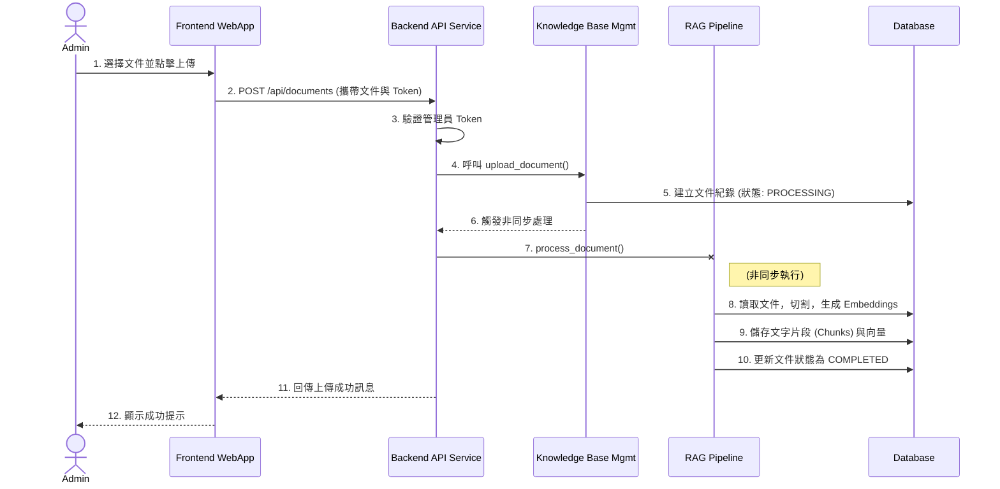
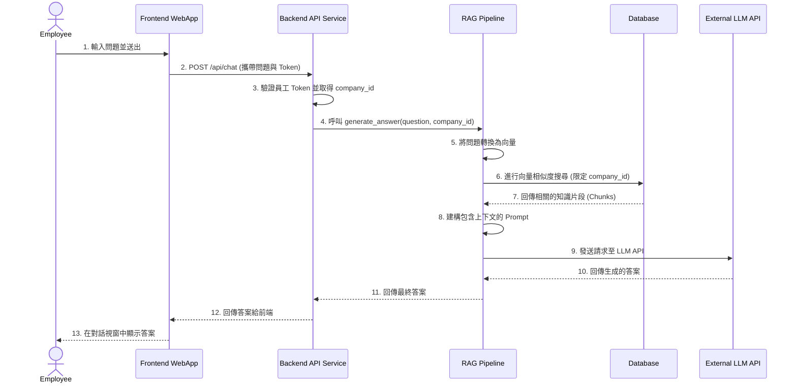

# HR 內部問答系統架構文件

## 1\. 簡介 (Introduction)

本文件概述了 HR 內部問答系統的整體專案架構，涵蓋後端系統、共享服務以及非 UI 的特定問題。其主要目標是作為 AI 驅動開發的指導性架構藍圖，確保所選模式和技術的一致性和遵循性。

**與前端架構的關係：**
由於本專案包含重要的使用者介面，因此獨立的《前端架構文件》將詳細說明前端的特定設計，並且**必須**與本文件結合使用。本文件中記錄的核心技術棧選擇（請參閱下文的「技術棧」部分）是整個專案（包括任何前端元件）的最終決定。

### 1.1 入門模板或現有專案 (Starter Template or Existing Project)

N/A - Greenfield project (新專案)

### 1.2 變更日誌 (Change Log)

| 日期 | 版本 | 描述 | 作者 |
| :--- | :--- | :--- | :--- |
| 2025-08-19 | 1.0 | 初始架構文件建立 | Winston (Architect) |

## 2\. 高層架構 (High Level Architecture)

### 2.1 技術摘要 (Technical Summary)

本專案將採用**單體式服務 (Monolith)** 架構，並存放於 **Monorepo (單體式倉儲)** 中，以簡化 MVP 階段的開發與部署流程。前端將使用 **React/TypeScript** 開發，提供一個響應式的 Web 介面給員工與管理員。後端服務則使用 **Python/FastAPI** 框架，負責處理商業 logique、使用者驗證，以及核心的 **RAG (Retrieval-Augmented Generation)** 問答管線。所有結構化資料（如使用者、公司資訊）和向量化後的知識片段 (Embeddings) 將統一儲存在 **PostgreSQL 資料庫**中，並利用其 **PGVector** 擴充套件進行高效的向量相似度搜尋。此架構旨在透過清晰的職責分離與簡化的技術棧，直接支持 PRD 中定義的自動化問答、多租戶資料隔離及高效管理的核心目標。

### 2.2 高層概覽 (High Level Overview)

  * **架構風格 (Architectural Style):** 單體式服務 (Monolith)。此決策是為了在 MVP 階段最大化開發速度並降低部署的複雜性。
  * **倉儲結構 (Repository Structure):** Monorepo。前後端程式碼將存放在同一個 Git 倉儲中，便於共享設定、類型定義與統一管理。
  * **服務架構 (Service Architecture):** 單體式服務 (Monolith)。單一後端應用程式將處理所有 API 請求，包括身份驗證、文件管理和 RAG 問答。
  * **主要流程 (Primary Flow):**
    1.  **管理員**登入後台上傳文件至其所屬公司的知識庫。
    2.  **員工**透過其專屬 ID 登入，並在聊天介面中提出問題。
    3.  後端服務根據員工的公司 ID，從 PGVector 中檢索最相關的資訊片段，結合大型語言模型 (LLM) 生成答案，最後回傳給員工。
  * **核心決策理由 (Rationale):** 選擇 Monolith 與 Monorepo 是為了簡化初期開發，避免在微服務通訊與多倉儲同步上花費過多精力。使用 PGVector 作為向量資料庫，將所有資料類型統一管理在 PostgreSQL 中，大幅降低了技術棧的維運成本，是 MVP 的最佳選擇。

### 2.3 高層專案圖 (High Level Project Diagram)

```mermaid
graph TD
    subgraph Users
        U1[員工 (Employee)]
        U2[管理員 (Administrator)]
    end

    subgraph "Browser"
        WebApp[WebApp (React Frontend)]
    end

    subgraph "Backend Service (Python/FastAPI - Monolith)"
        API[REST API]
        Logic[Business Logic & Auth]
        RAG[RAG Pipeline / LLM Integration]
    end

    subgraph "Database"
        DB[PostgreSQL + PGVector]
    end

    U1 --> WebApp
    U2 --> WebApp
    WebApp -- HTTP Requests --> API
    API --> Logic
    API --> RAG
    Logic -- CRUD Operations --> DB
    RAG -- Vector Search & Retrieval --> DB

    style DB fill:#cce6ff
```

### 2.4 架構與設計模式 (Architectural and Design Patterns)

  * **- 單體式架構 (Monolith Architecture):** 整個後端應用程式作為單一部署單元。
      * **理由:** 符合 MVP 快速開發、簡化部署的目標。
  * **- 多租戶資料隔離 (Multi-Tenancy Data Isolation):** 這是本專案的核心安全模式。所有資料庫查詢（包括向量搜尋）都必須嚴格地透過 `company_id` 進行篩選，確保一個公司的使用者絕對無法存取到另一公司的資料。
  * **- 倉儲模式 (Repository Pattern):** 在後端應用中，將資料存取邏輯（對 PostgreSQL 的操作）從商業邏輯中分離出來。
      * **理由:** 使商業邏輯更清晰、易於測試，並且未來若需更換資料庫也更有彈性。
  * **- 元件式架構 (Component-Based Architecture):** 在前端，UI 將由獨立、可重複使用的 React 元件組成。
      * **理由:** 這是 React 的標準實踐，能提高開發效率與程式碼的可維護性。

## 3\. 技術棧 (Tech Stack)

### 3.1 雲端基礎設施 (Cloud Infrastructure)

  * **提供商 (Provider):** 暫緩決定 (Decision Deferred)
  * **關鍵服務 (Key Services):** 根據 PRD 指示，MVP 階段專注於本地開發，雲端部署方案將在後續階段定義。
  * **部署區域 (Deployment Regions):** N/A

### 3.2 技術棧表格 (Technology Stack Table)

| 分類 | 技術 | 版本 | 目的 | 理由 |
| :--- | :--- | :--- | :--- | :--- |
| **前端 - 語言** | TypeScript | \~5.4 | 主要開發語言 | 提供強大的型別檢查，減少執行時錯誤，提升程式碼品質與可維護性。 |
| **前端 - 框架** | React | \~18.2 | 建構使用者介面 | 成熟的生態系、豐富的元件庫和龐大的社群支持，能快速打造高效的管理儀表板與對話介面。 |
| **前端 - UI 元件庫** | MUI (Material-UI) | \~5.15 | 加速 UI 開發 | 提供一整套高品質、可自訂的 React 元件，非常適合快速建置專業的管理後台。 |
| **前端 - 狀態管理**| Zustand | \~4.5 | 管理全域前端狀態 | 輕量、簡單且易於使用，相較於 Redux 更適合此專案規模，能有效管理登入狀態等資訊。 |
| **前端 - 路由** | React Router | \~6.22 | 處理頁面導航 | React 應用程式的標準路由解決方案，功能強大且穩定。 |
| **前端 - 建置工具**| Vite | \~5.2 | 開發伺服器與打包 | 提供極速的熱模組替換 (HMR) 和高效能的打包輸出，大幅提升開發體驗。 |
| **前端 - 測試** | Vitest & RTL | \~1.6 & \~15.0 | 單元與整合測試 | Vitest 與 Vite 無縫整合，提供快速的測試執行。React Testing Library (RTL) 鼓勵以使用者為中心的測試方法。 |
| **後端 - 語言** | Python | \~3.11 | 主要後端語言 | AI 與 NLP 領域的首選，擁有 LangChain、LlamaIndex 等豐富函式庫，是實現 RAG 的最佳選擇。 |
| **後端 - 框架** | FastAPI | \~0.111 | 提供 API 服務 | 高性能、內建非同步支持與自動化文件生成。其基於 Pydantic 的資料驗證機制能確保 API 的穩定性。 |
| **API 風格** | REST API | N/A | 前後端通訊協定 | 成熟、普遍且易於理解，有大量的工具和實踐支持。 |
| **資料庫** | PostgreSQL | \~16 | 結構化與向量資料儲存 | 一個強大且可靠的關聯式資料庫，用於儲存使用者、公司等資料。 |
| **資料庫 - 擴充** | PGVector | \~0.7 | 向量相似度搜尋 | 讓 PostgreSQL 直接支援向量儲存與搜尋，簡化了技術棧，無需額外維護一個專門的向量資料庫。 |
| **後端 - ORM** | SQLAlchemy | \~2.0 | 資料庫互動層 | Python 中最成熟的 ORM，提供強大的查詢能力並將資料庫操作與業務邏輯解耦。 |
| **後端 - 測試** | Pytest | \~8.2 | 單元與整合測試 | Python 社群最主流的測試框架，功能強大、易於擴展。 |

## 4\. 資料模型 (Data Models)

### 公司 (Company)

  * **用途 (Purpose):** 代表系統中的一個獨立租戶，擁有自己獨立的員工和知識庫。
  * **關鍵屬性 (Key Attributes):**
      * `id`: `UUID` - 唯一識別碼 (主鍵)。
      * `name`: `VARCHAR(255)` - 公司名稱。
      * `created_at`: `TIMESTAMP` - 建立時間。
  * **關聯 (Relationships):**
      * 一個「公司」可以有多個「員工」(Users)。
      * 一個「公司」可以有多個「知識文件」(Knowledge Documents)。

### 管理員 (Admin)

  * **用途 (Purpose):** 負責管理整個系統的超級使用者，可以新增公司和管理知識庫。
  * **關鍵屬性 (Key Attributes):**
      * `id`: `UUID` - 唯一識別碼 (主鍵)。
      * `email`: `VARCHAR(255)` - 登入用電子郵件 (唯一)。
      * `password_hash`: `VARCHAR(255)` - 加密後的密碼。
      * `created_at`: `TIMESTAMP` - 建立時間。
  * **關聯 (Relationships):**
      * 管理員與公司沒有直接綁定，屬於全域管理角色。

### 員工 (User)

  * **用途 (Purpose):** 系統的終端使用者，透過特定編號登入並提出問題。
  * **關鍵屬性 (Key Attributes):**
      * `id`: `UUID` - 唯一識別碼 (主鍵)。
      * `employee_id`: `VARCHAR(100)` - 員工用來登入的特定編號 (在同一公司內應唯一)。
      * `company_id`: `UUID` - 關聯至其所屬的「公司」 (外鍵)。
      * `created_at`: `TIMESTAMP` - 建立時間。
  * **關聯 (Relationships):**
      * 每個「員工」必須屬於一個「公司」。

### 知識文件 (KnowledgeDocument)

  * **用途 (Purpose):** 記錄由管理員上傳的原始文件資訊。
  * **關鍵屬性 (Key Attributes):**
      * `id`: `UUID` - 唯一識別碼 (主鍵)。
      * `file_name`: `VARCHAR(255)` - 原始檔案名稱。
      * `status`: `VARCHAR(50)` - 處理狀態 (例如：`PROCESSING`, `COMPLETED`, `FAILED`)。
      * `company_id`: `UUID` - 關聯至其所屬的「公司」 (外鍵)。
      * `uploaded_at`: `TIMESTAMP` - 上傳時間。
  * **關聯 (Relationships):**
      * 每個「知識文件」必須屬於一個「公司」。
      * 一個「知識文件」可以被切割成多個「知識片段」(Document Chunks)。

### 知識片段 (DocumentChunk)

  * **用途 (Purpose):** 儲存從原始文件中切割出來的文字片段及其對應的向量 (Embedding)。
  * **關鍵屬性 (Key Attributes):**
      * `id`: `UUID` - 唯一識別碼 (主鍵)。
      * `document_id`: `UUID` - 關聯至其來源的「知識文件」 (外鍵)。
      * `company_id`: `UUID` - 關聯至其所屬的「公司」 (外鍵，用於加速查詢和確保資料隔離)。
      * `chunk_text`: `TEXT` - 文字片段的內容。
      * `embedding`: `VECTOR` - 該文字片段的向量表示 (由 PGVector 提供)。
      * `created_at`: `TIMESTAMP` - 建立時間。
  * **關聯 (Relationships):**
      * 每個「知識片段」來自一個「知識文件」並屬於一個「公司」。

### 使用者回饋 (FeedbackLog)

  * **用途 (Purpose):** 記錄員工對問答結果的回饋，用於系統優化。
  * **關鍵屬性 (Key Attributes):**
      * `id`: `UUID` - 唯一識別碼 (主鍵)。
      * `user_id`: `UUID` - 提供回饋的「員工」 (外鍵)。
      * `question`: `TEXT` - 員工提出的原始問題。
      * `answer`: `TEXT` - 系統生成的回答。
      * `feedback`: `VARCHAR(20)` - 回饋類型 (例如 `POSITIVE` 或 `NEGATIVE`)。
      * `created_at`: `TIMESTAMP` - 回饋時間。
  * **關聯 (Relationships):**
      * 每個「使用者回饋」由一位「員工」創建。

## 5\. 元件 (Components)

### 元件列表 (Component List)

#### 前端 Web 應用 (Frontend WebApp)

  * **職責 (Responsibility):** 提供員工和管理員所需的所有使用者介面 (UI) 與使用者體驗 (UX)。處理瀏覽器端的狀態管理、使用者輸入和 API 請求的發送。
  * **關鍵介面 (Key Interfaces):**
      * 員工對話介面 (`/chat`)
      * 管理員儀表板 (`/admin/*`)
      * 登入頁面
  * **依賴 (Dependencies):** 後端 API 服務 (Backend API Service)。
  * **技術棧 (Technology Stack):** React, TypeScript, MUI, Zustand, Vite, React Router。

#### 後端 API 服務 (Backend API Service)

  * **職責 (Responsibility):** 作為系統的統一入口，接收並處理所有來自前端的 HTTP 請求，並協調其他後端元件完成工作。
  * **關鍵介面 (Key Interfaces):**
      * RESTful API 端點 (e.g., `/api/admin/login`, `/api/documents`, `/api/chat`)。
  * **依賴 (Dependencies):** 身份驗證、知識庫管理、RAG 管線、資料庫等所有後端元件。
  * **技術棧 (Technology Stack):** Python, FastAPI。

#### 身份驗證元件 (Authentication Component)

  * **職責 (Responsibility):** 處理管理員和員工的登入、登出邏輯。生成、驗證和解析用於保護 API 的 Token (JWT)。
  * **關鍵介面 (Key Interfaces):**
      * 內部函式，如 `create_access_token()`, `get_current_user()`。
  * **依賴 (Dependencies):** 資料庫元件 (Database Component)。
  * **技術棧 (Technology Stack):** Python, `passlib` (用於密碼雜湊), `python-jose` (用於 JWT)。

#### 知識庫管理元件 (Knowledge Base Management Component)

  * **職責 (Responsibility):** 處理知識文件的完整生命週期，包括上傳、觸發處理、列表檢視和刪除。
  * **關鍵介面 (Key Interfaces):**
      * 內部函式，如 `upload_and_schedule_processing()`, `delete_document_and_embeddings()`。
  * **依賴 (Dependencies):** 資料庫元件 (Database Component)、RAG 管線元件 (RAG Pipeline Component) (用於觸發 Embedding 處理)。
  * **技術棧 (Technology Stack):** Python, `python-docx`, `pypdf` (用於解析文件)。

#### RAG 管線元件 (RAG Pipeline Component)

  * **職責 (Responsibility):** 執行核心的問答邏輯。接收問題，將其向量化，從資料庫中檢索相關的知識片段，建構提示 (Prompt)，呼叫大型語言模型 (LLM) 生成答案。
  * **關鍵介面 (Key Interfaces):**
      * 內部函式，如 `generate_answer_for_query(query, company_id)`。
  * **依賴 (Dependencies):** 資料庫元件 (Database Component) (用於向量搜尋)、外部 LLM 服務 (例如 OpenAI API)。
  * **技術棧 (Technology Stack):** Python, LangChain/LlamaIndex, Sentence Transformers (用於 Embedding)。

#### 使用者回饋元件 (Feedback Component)

  * **職責 (Responsibility):** 接收並儲存員工對答案的回饋。
  * **關鍵介面 (Key Interfaces):**
      * 內部函式，如 `log_feedback()`。
  * **依賴 (Dependencies):** 資料庫元件 (Database Component)。
  * **技術棧 (Technology Stack):** Python, SQLAlchemy。

#### 資料庫元件 (Database Component)

  * **職責 (Responsibility):** 提供穩定、可靠的資料持久化儲存，包括結構化資料和向量資料。
  * **關鍵介面 (Key Interfaces):**
      * SQLAlchemy ORM (用於結構化資料)
      * SQL 查詢 (用於 PGVector 的向量搜尋)。
  * **依賴 (Dependencies):** 無。
  * **技術棧 (Technology Stack):** PostgreSQL, PGVector, SQLAlchemy。

### 元件關係圖 (Component Diagrams)

此圖展示了在單體式服務內部，這些邏輯元件之間的互動關係。

```mermaid
graph TD
    subgraph Browser
        FE[Frontend WebApp]
    end

    subgraph "Backend Monolith"
        API[API Service Layer]
        Auth[Authentication Component]
        KB[Knowledge Base Mgmt]
        RAG[RAG Pipeline]
        FB[Feedback Component]
    end

    subgraph "Data Store"
        DB[Database Component (PostgreSQL + PGVector)]
    end

    FE -- REST API Calls --> API
    API --> Auth
    API --> KB
    API --> RAG
    API --> FB

    Auth --> DB
    KB --> DB
    RAG --> DB
    FB --> DB

    KB -- Triggers Embedding --> RAG
    RAG -- Calls --> Ext_LLM[External LLM Service]

    style API fill:#f9f,stroke:#333,stroke-width:2px
    style DB fill:#cce6ff,stroke:#333,stroke-width:2px
```

## 6\. 外部 API (External APIs)

根據 PRD，本系統的核心 RAG 功能需要與一個外部的大型語言模型 (LLM) 服務進行整合。

### 大型語言模型 API (Large Language Model API)

  * **用途 (Purpose):** 接收由 RAG 管線元件建構好的提示 (Prompt)，並生成自然、流暢的文字回答。
  * **文件 (Documentation):** 待定 (TBD) - 將根據最終選擇的 LLM 供應商（如 OpenAI, Google, Anthropic 等）決定。
  * **基礎 URL (Base URL):** TBD
  * **驗證方式 (Authentication):** TBD (通常為 API Key)。
  * **速率限制 (Rate Limits):** TBD
  * **將使用的關鍵端點 (Key Endpoints Used):**
      * `POST /v1/chat/completions` (或類似的對話/生成端點)。
  * **整合注意事項 (Integration Notes):**
      * 後端服務必須安全地管理和存取 LLM 的 API Key，嚴禁將其硬編碼在程式碼中。
      * 後端應設計一個抽象層來呼叫 LLM，以便未來可以輕鬆更換或升級模型，而無需大幅修改程式碼。

## 7\. 核心工作流程 (Core Workflows)

以下是兩個核心業務流程的循序圖 (Sequence Diagrams)，用以說明各元件之間的詳細互動。

### 流程 1: 管理員上傳與處理文件

此流程展示了從管理員上傳文件到系統完成學習的完整過程。



### 流程 2: 員工問答

此流程展示了員工從提出問題到獲得 AI 回答的完整過程。



## 8\. REST API 規格 (REST API Spec)

這是一份遵循 OpenAPI 3.0 標準的 API 規格草案，定義了所有根據 PRD 故事所需的核心端點。

```yaml
openapi: 3.0.0
info:
  title: HR 內部問答系統 API
  version: "1.0.0"
  description: 用於 HR 內部問答系統的前後端通訊 API。

servers:
  - url: /api
    description: 開發伺服器

components:
  schemas:
    # --- Request Schemas ---
    AdminLoginRequest:
      type: object
      properties:
        email:
          type: string
          format: email
        password:
          type: string
    UserLoginRequest:
      type: object
      properties:
        employee_id:
          type: string
    NewCompanyRequest:
      type: object
      properties:
        name:
          type: string
    QuestionRequest:
      type: object
      properties:
        question:
          type: string
    FeedbackRequest:
      type: object
      properties:
        question:
          type: string
        answer:
          type: string
        feedback:
          type: string
          enum: [POSITIVE, NEGATIVE]

    # --- Response Schemas ---
    LoginResponse:
      type: object
      properties:
        access_token:
          type: string
        token_type:
          type: string
          example: bearer
    Company:
      type: object
      properties:
        id:
          type: string
          format: uuid
        name:
          type: string
    KnowledgeDocument:
      type: object
      properties:
        id:
          type: string
          format: uuid
        file_name:
          type: string
        status:
          type: string
        uploaded_at:
          type: string
          format: date-time
    AnswerResponse:
      type: object
      properties:
        answer:
          type: string
    Error:
      type: object
      properties:
        detail:
          type: string

  securitySchemes:
    bearerAuth:
      type: http
      scheme: bearer
      bearerFormat: JWT

security:
  - bearerAuth: []

paths:
  # --- Authentication Endpoints ---
  /admin/login:
    post:
      tags: [Admin Auth]
      summary: 管理員登入
      requestBody:
        required: true
        content:
          application/json:
            schema:
              $ref: '#/components/schemas/AdminLoginRequest'
      responses:
        '200':
          description: 登入成功
          content:
            application/json:
              schema:
                $ref: '#/components/schemas/LoginResponse'
        '401':
          description: 驗證失敗
          content:
            application/json:
              schema:
                $ref: '#/components/schemas/Error'

  /login:
    post:
      tags: [User Auth]
      summary: 員工登入
      requestBody:
        required: true
        content:
          application/json:
            schema:
              $ref: '#/components/schemas/UserLoginRequest'
      responses:
        '200':
          description: 登入成功
          content:
            application/json:
              schema:
                $ref: '#/components/schemas/LoginResponse'
        '401':
          description: 驗證失敗

  # --- Admin Endpoints ---
  /admin/companies:
    get:
      tags: [Admin]
      summary: 取得所有公司列表
      responses:
        '200':
          description: 成功
          content:
            application/json:
              schema:
                type: array
                items:
                  $ref: '#/components/schemas/Company'
    post:
      tags: [Admin]
      summary: 新增一間公司
      requestBody:
        required: true
        content:
          application/json:
            schema:
              $ref: '#/components/schemas/NewCompanyRequest'
      responses:
        '201':
          description: 公司建立成功
          content:
            application/json:
              schema:
                $ref: '#/components/schemas/Company'

  /admin/knowledge/documents:
    get:
      tags: [Admin]
      summary: 取得公司知識庫文件列表
      responses:
        '200':
          description: 成功
          content:
            application/json:
              schema:
                type: array
                items:
                  $ref: '#/components/schemas/KnowledgeDocument'
    post:
      tags: [Admin]
      summary: 上傳知識文件
      requestBody:
        content:
          multipart/form-data:
            schema:
              type: object
              properties:
                file:
                  type: string
                  format: binary
      responses:
        '202':
          description: 文件已接收並開始處理
        '400':
          description: 請求無效

  /admin/knowledge/documents/{documentId}:
    delete:
      tags: [Admin]
      summary: 刪除知識文件及其 Embeddings
      parameters:
        - name: documentId
          in: path
          required: true
          schema:
            type: string
            format: uuid
      responses:
        '204':
          description: 刪除成功

  # --- User/Chat Endpoints ---
  /chat:
    post:
      tags: [Chat]
      summary: 提出問題並取得答案
      requestBody:
        required: true
        content:
          application/json:
            schema:
              $ref: '#/components/schemas/QuestionRequest'
      responses:
        '200':
          description: 成功取得答案
          content:
            application/json:
              schema:
                $ref: '#/components/schemas/AnswerResponse'

  /chat/feedback:
    post:
      tags: [Chat]
      summary: 提交對答案的回饋
      requestBody:
        required: true
        content:
          application/json:
            schema:
              $ref: '#/components/schemas/FeedbackRequest'
      responses:
        '201':
          description: 回饋已記錄
```

## 9\. 資料庫綱要 (Database Schema)

以下是在 PostgreSQL 中建立專案所需資料庫結構的 SQL 指令碼。

```sql
-- 啟用必要的擴充功能
-- 用於生成 UUID
CREATE EXTENSION IF NOT EXISTS "uuid-ossp";
-- 啟用 pgvector 以支援向量儲存與搜尋
CREATE EXTENSION IF NOT EXISTS vector;

-- 1. 公司 (Tenants)
CREATE TABLE companies (
    id UUID PRIMARY KEY DEFAULT uuid_generate_v4(),
    name VARCHAR(255) NOT NULL,
    created_at TIMESTAMPTZ NOT NULL DEFAULT NOW()
);

COMMENT ON TABLE companies IS '儲存系統中的租戶，即各個獨立公司';

-- 2. 管理員
CREATE TABLE admins (
    id UUID PRIMARY KEY DEFAULT uuid_generate_v4(),
    email VARCHAR(255) UNIQUE NOT NULL,
    password_hash VARCHAR(255) NOT NULL,
    created_at TIMESTAMPTZ NOT NULL DEFAULT NOW()
);

COMMENT ON TABLE admins IS '儲存可以登入管理後台的管理員帳號';

-- 3. 員工
CREATE TABLE users (
    id UUID PRIMARY KEY DEFAULT uuid_generate_v4(),
    employee_id VARCHAR(100) NOT NULL,
    company_id UUID NOT NULL REFERENCES companies(id) ON DELETE CASCADE,
    created_at TIMESTAMPTZ NOT NULL DEFAULT NOW(),
    UNIQUE(company_id, employee_id) -- 確保員工編號在同一公司內是唯一的
);

COMMENT ON TABLE users IS '儲存系統的終端使用者(員工)';

-- 4. 知識文件
CREATE TABLE knowledge_documents (
    id UUID PRIMARY KEY DEFAULT uuid_generate_v4(),
    file_name VARCHAR(255) NOT NULL,
    status VARCHAR(50) NOT NULL CHECK (status IN ('PROCESSING', 'COMPLETED', 'FAILED')),
    company_id UUID NOT NULL REFERENCES companies(id) ON DELETE CASCADE,
    uploaded_at TIMESTAMPTZ NOT NULL DEFAULT NOW()
);

COMMENT ON TABLE knowledge_documents IS '記錄管理員上傳的原始文件';

-- 5. 知識片段 (Embeddings)
-- 注意: 'vector(768)' 中的 768 是一個範例維度。
-- 實際維度必須與您選擇的 Embedding 模型輸出維度完全一致。
CREATE TABLE document_chunks (
    id UUID PRIMARY KEY DEFAULT uuid_generate_v4(),
    document_id UUID NOT NULL REFERENCES knowledge_documents(id) ON DELETE CASCADE,
    company_id UUID NOT NULL REFERENCES companies(id) ON DELETE CASCADE,
    chunk_text TEXT NOT NULL,
    embedding vector(768) NOT NULL,
    created_at TIMESTAMPTZ NOT NULL DEFAULT NOW()
);

COMMENT ON TABLE document_chunks IS '儲存從文件中切割出來的文字片段及其向量';

-- 為向量欄位建立索引以加速相似度搜尋
-- HNSW (Hierarchical Navigable Small World) 索引通常在準確性和速度之間有很好的平衡
CREATE INDEX ON document_chunks USING HNSW (embedding vector_l2_ops);

-- 6. 使用者回饋
CREATE TABLE feedback_logs (
    id UUID PRIMARY KEY DEFAULT uuid_generate_v4(),
    user_id UUID REFERENCES users(id) ON DELETE SET NULL, -- 如果員工被刪除，保留其回饋
    question TEXT NOT NULL,
    answer TEXT NOT NULL,
    feedback VARCHAR(20) NOT NULL CHECK (feedback IN ('POSITIVE', 'NEGATIVE')),
    created_at TIMESTAMPTZ NOT NULL DEFAULT NOW()
);

COMMENT ON TABLE feedback_logs IS '記錄員工對問答結果的回饋';
```

## 10\. 原始碼目錄結構 (Source Tree)

根據 Monorepo 的架構決策 以及前後端分離的技術棧，我建議採用以下目錄結構。這種結構將應用程式 (`apps`) 和共享程式碼 (`packages`) 分開，是業界管理 Monorepo 的一種成熟實踐。

```plaintext
hr-rag-system/
├── apps/                   # 存放可獨立部署的應用程式
│   ├── frontend/           # React 前端應用
│   │   ├── public/         # 靜態資源 (icon, html 模板等)
│   │   ├── src/
│   │   │   ├── api/        # 呼叫後端 API 的服務層
│   │   │   ├── components/ # 可重複使用的 UI 元件 (e.g., Button, Input)
│   │   │   ├── hooks/      # 自訂的 React Hooks
│   │   │   ├── pages/      # 頁面級元件 (e.g., ChatPage, AdminDashboard)
│   │   │   ├── store/      # Zustand 狀態管理
│   │   │   ├── styles/     # 全域樣式與主題
│   │   │   └── App.tsx     # 應用程式主入口
│   │   ├── package.json    # 前端專案依賴
│   │   └── vite.config.ts  # Vite 設定檔
│   │
│   └── backend/            # FastAPI 後端應用
│       ├── app/
│       │   ├── api/        # API 路由器 (Routers)
│       │   ├── core/       # 核心設定、配置
│       │   ├── db/         # 資料庫連線與 SQLAlchemy 模型
│       │   ├── schemas/    # Pydantic 資料驗證模型
│       │   ├── services/   # 核心商業邏輯 (e.g., rag_service, auth_service)
│       │   └── main.py     # 後端應用程式主入口
│       ├── tests/          # 後端測試
│       └── pyproject.toml  # Python 專案依賴 (e.g., using Poetry)
│
├── packages/               # 存放跨應用共享的程式碼
│   └── shared-types/       # TypeScript 型別定義
│       ├── src/            # 用於定義 API 回應等共享型別
│       └── package.json
│
├── scripts/                # 專案級別的腳本 (e.g., build, deploy)
│
├── .gitignore
├── package.json            # Monorepo 根目錄的 package.json (管理 workspaces)
└── README.md
```

## 11\. 基礎設施與部署 (Infrastructure and Deployment)

### 11.1 基礎設施即程式碼 (Infrastructure as Code)

  * **工具 (Tool):** 暫緩決定 (TBD) - 將根據最終選擇的雲端平台決定 (例如 AWS CDK, Terraform)。
  * **位置 (Location):** 所有 IaC 的程式碼將存放於倉儲根目錄的 `infrastructure/` 資料夾中。
  * **方法 (Approach):** MVP 階段將不實現 IaC。待未來確定雲端平台後，將使用 IaC 來自動化管理所有雲端資源的建立與設定。

### 11.2 部署策略 (Deployment Strategy)

  * **策略 (Strategy):** MVP 階段將採用基於 Docker Compose 的本地容器化部署。未來將發展為基於 CI/CD 的自動化部署策略。
  * **CI/CD 平台 (CI/CD Platform):** 暫緩決定 (TBD) - (例如 GitHub Actions)。
  * **管線設定檔位置 (Pipeline Configuration):** N/A

### 11.3 環境 (Environments)

  * **- 開發 (Development):** 在開發人員本機上，透過 Docker Compose 運行的完整環境。
  * **- 預備 (Staging):** (未來規劃) 用於部署前進行最終測試的類生產環境。
  * **- 生產 (Production):** (未來規劃) 實際提供給終端使用者服務的正式環境。

### 11.4 環境提升流程 (Environment Promotion Flow)

```plaintext
(本地開發) Feature Branch -> Pull Request -> `main` branch (未來觸發 Staging/Prod 部署)
```

### 11.5 回滾策略 (Rollback Strategy)

  * **主要方法 (Primary Method):** 在本地開發中，透過 Git `revert` 或 `reset` 回到上一個穩定版本。在未來的生產環境中，將採用重新部署上一個穩定版本的容器映像 (Docker Image) 作為主要回滾策略。
  * **觸發條件 (Trigger Conditions):** 嚴重的功能故障、系統崩潰等。
  * **復原時間目標 (RTO):** N/A

## 12\. 錯誤處理策略 (Error Handling Strategy)

### 12.1 整體方法 (General Approach)

  * **錯誤模型 (Error Model):**
      * **後端 (FastAPI):** 將實作一個全域的例外處理中介軟體 (Middleware)。此中介軟體會攔截所有未處理的例外，並將其格式化為統一的 JSON 錯誤回應 (例如 `{"error": {"code": "internal_error", "message": "An unexpected error occurred."}}`)，避免將程式碼堆疊追蹤等敏感資訊洩漏給客戶端。
      * **前端 (React):** 將使用 React 的「錯誤邊界」(Error Boundaries) 元件來捕捉和處理 UI 渲染過程中的錯誤，防止整個應用程式崩潰。對於 API 請求的錯誤，將在 API 服務層進行捕捉和處理。
  * **例外階層 (Exception Hierarchy):** 在後端，我們將定義一個基礎的 `AppException`，並從中衍生出更具體的業務邏輯例外，例如 `NotFoundException`, `PermissionDeniedException` 等。
  * **錯誤傳播 (Error Propagation):** 後端服務層應向上拋出例外，由最上層的 API 中介軟體統一捕捉並回應。前端的 API 服務層在捕捉到錯誤後，應更新對應的狀態，讓 UI 元件能夠據此顯示友善的錯誤訊息。

### 12.2 日誌標準 (Logging Standards)

  * **函式庫 (Library):**
      * **後端:** 使用 Python 內建的 `logging` 模組，並搭配 `structlog` 以輸出結構化的 JSON 格式日誌。
      * **前端:** 建立一個簡單的日誌服務，封裝 `console.error`，以便未來可以輕鬆地將日誌發送到 Sentry 或 LogRocket 等第三方服務。
  * **格式 (Format):** 所有日誌都應為 JSON 格式，以便於日誌系統（如 ELK Stack, Datadog）的收集與查詢。
  * **級別 (Levels):** 遵循標準日誌級別 (DEBUG, INFO, WARNING, ERROR, CRITICAL)。
  * **必要內容 (Required Context):** 為了有效偵錯，每一條錯誤日誌都必須包含：
      * **`request_id`:** 一個唯一的請求 ID，用以追蹤單次請求在系統中的完整路徑。
      * **`company_id`:** 發生錯誤的公司租戶 ID。
      * **`user_id`:** 觸發錯誤的使用者 ID (如果有的話)。

### 12.3 錯誤處理模式 (Error Handling Patterns)

#### 外部 API 錯誤 (LLM API)

  * **重試策略 (Retry Policy):** 對於暫時性網路錯誤 (如 502, 503)，將實作一個指數退避 (exponential backoff) 的重試機制。
  * **逾時設定 (Timeout Configuration):** 所有對外部 LLM API 的呼叫都必須設定合理的逾時時間（例如 15 秒），以防止請求長時間卡住。
  * **錯誤轉譯 (Error Translation):** RAG 服務在捕捉到來自 LLM 供應商的特定 API 錯誤後，應將其轉譯為一個統一的內部 `ExternalServiceException`。

#### 業務邏輯錯誤

  * **自訂例外 (Custom Exceptions):** 對於特定的業務規則違規（例如：上傳了不支援的文件格式），應拋出明確的自訂例外。
  * **面向使用者的錯誤 (User-Facing Errors):** 前端應根據後端回傳的 HTTP 狀態碼 (400, 401, 403, 500) 和錯誤碼，向使用者顯示清晰、友善的錯誤訊息。

#### 資料一致性

  * **交易策略 (Transaction Strategy):** 對於任何需要修改多個資料表的操作（例如刪除文件及其所有相關的知識片段），都必須使用資料庫交易 (Transaction) 來確保操作的原子性：要麼全部成功，要麼全部回滾。

## 13\. 編碼標準 (Coding Standards)

### 13.1 核心標準 (Core Standards)

  * **語言與執行環境 (Languages & Runtimes):**
      * **後端:** Python \~3.11
      * **前端:** TypeScript \~5.4, Node.js \~20.x
  * **風格與 Linter (Style & Linting):**
      * **後端:**
          * **格式化:** 強制使用 `Black` 進行程式碼格式化。
          * **Linter:** 強制使用 `Ruff` 進行程式碼風格和品質檢查。
      * **前端:**
          * **格式化:** 強制使用 `Prettier` 進行程式碼格式化。
          * **Linter:** 強制使用 `ESLint` 進行程式碼風格和品質檢查。
      * **備註:** 相關設定檔 (`pyproject.toml`, `.eslintrc`, `.prettierrc`) 將存放於專案根目錄。
  * **測試組織 (Test Organization):**
      * 測試檔案必須與其測試的原始碼檔案放在同一個目錄下，並以 `_test.py` (後端) 或 `.test.tsx` / `.spec.ts` (前端) 結尾。

### 13.2 命名慣例 (Naming Conventions)

  * **後端 (Python):** 遵循 **PEP 8** 標準。
      * 變數與函式: `snake_case` (蛇形命名法)。
      * 類別: `PascalCase` (大駝峰命名法)。
  * **前端 (TypeScript/React):** 遵循社群標準。
      * 變數與函式: `camelCase` (小駝峰命名法)。
      * React 元件與型別/介面: `PascalCase` (大駝峰命名法)。
      * 檔案: React 元件使用 `PascalCase.tsx`，其他 `camelCase.ts`。

### 13.3 關鍵規則 (Critical Rules)

**這些是 AI 開發代理必須嚴格遵守的規則：**

1.  **- 強制多租戶隔離 (Multi-Tenancy Enforcement):**
      * **規則:** 任何存取與特定公司相關資料的資料庫查詢（包括 SQL 和向量搜尋），**必須**包含 `WHERE company_id = :company_id` 的過濾條件。**沒有例外**。
2.  **- 存取設定值 (Configuration Access):**
      * **規則:** 嚴禁在程式碼中直接使用 `os.environ.get()` 或 `process.env` 存取環境變數。所有設定值都必須透過後端 `app/core/config.py` 中定義的集中式設定物件來取得。
3.  **- 資料庫存取層 (Database Access):**
      * **規則:** 所有資料庫互動**必須**透過倉儲模式 (Repository Pattern) 實作的資料存取層 (`app/db/`) 進行。嚴禁在 API 路由或服務層直接操作 SQLAlchemy 的 session 物件。
4.  **- API 錯誤回應 (API Error Responses):**
      * **規則:** 所有 API 的錯誤回應**必須**透過拋出一個自訂的例外（例如 `NotFoundException`）來生成，並由全域錯誤處理中介軟體來格式化最終的 JSON 回應。嚴禁在端點中手動回傳錯誤的 JSON。
5.  **- 避免日誌洩漏 (No Sensitive Info in Logs):**
      * **規則:** 嚴禁在日誌中記錄任何敏感資訊，包括但不限於使用者密碼、API Keys 或 Token。

## 14\. 測試策略與標準 (Test Strategy and Standards)

### 14.1 測試理念 (Testing Philosophy)

  * **方法 (Approach):** 我們將採用「測試導向開發」(Test-Informed Development)。這意味著開發人員在完成功能實作的同時或之後，立即為其撰寫測試，以確保程式碼的正確性和覆蓋率。
  * **覆蓋率目標 (Coverage Goals):**
      * **後端:** 核心業務邏輯的程式碼行覆蓋率應 **\> 80%**。
      * **前端:** 核心元件的程式碼行覆蓋率應 **\> 70%**。
  * **測試金字塔 (Test Pyramid):**
      * **基礎 (Foundation):** 大量的**單元測試 (Unit Tests)**，用於驗證獨立函式和元件的邏輯。
      * **中層 (Middle):** 適量的**整合測試 (Integration Tests)**，用於驗證系統內部元件之間的互動。
      * **頂層 (Top):** 少量的**端到端測試 (E2E Tests)**，用於驗證最關鍵的使用者流程。

### 14.2 測試類型與組織 (Test Types and Organization)

#### 單元測試 (Unit Tests)

  * **框架 (Framework):**
      * **後端:** `Pytest`
      * **前端:** `Vitest` & `React Testing Library (RTL)`
  * **檔案慣例 (File Convention):** `_test.py` (後端), `.test.tsx` (前端)。
  * **位置 (Location):** 測試檔案與被測試的原始碼檔案存放在同一目錄下。
  * **模擬函式庫 (Mocking Library):**
      * **後端:** Python 內建的 `unittest.mock`。
      * **前端:** `Vitest` 內建的 `vi.mock`。
  * **AI 代理開發要求:**
      * 為所有公開的函式/方法生成單元測試。
      * 測試需涵蓋正常路徑、邊界條件和錯誤處理。
      * 模擬所有外部依賴（例如資料庫呼叫、外部 API 請求）。

#### 整合測試 (Integration Tests)

  * **範圍 (Scope):**
      * **後端:** 測試 API 層 -\> 服務層 -\> 資料庫層的完整請求流程。
      * **前端:** 測試多個元件在一個頁面上的協同工作。
  * **位置 (Location):** 建議存放在各應用程式目錄下的 `tests/integration` 資料夾中。
  * **測試基礎設施 (Test Infrastructure):**
      * **資料庫:** 將使用 **Testcontainers** 在測試執行期間動態啟動一個真實的 PostgreSQL + PGVector Docker 容器。這確保了測試環境與生產環境的高度一致性。

#### 端到端測試 (End-to-End Tests)

  * **框架 (Framework):** **Playwright** (一個現代化的 E2E 測試框架)。
  * **範圍 (Scope):** 僅針對最核心的使用者流程進行測試，例如：
    1.  員工成功登入。
    2.  提出一個問題並成功獲得回答。
    3.  對答案提交一次回饋。

### 14.3 測試資料管理 (Test Data Management)

  * **策略 (Strategy):**
      * **測試固件 (Fixtures):** 使用 `Pytest Fixtures` (後端) 和簡單的 JSON/TS 物件 (前端) 來提供靜態、可重複使用的測試資料。
      * **工廠模式 (Factories):** 使用 `factory-boy` (後端) 來動態生成大量、結構化的假資料。
  * **清理 (Cleanup):** 每次整合測試執行完畢後，必須將資料庫交易 (Transaction) 回滾，以確保測試之間的獨立性。

### 14.4 持續測試 (Continuous Testing)

  * **CI 整合 (CI Integration):** (未來規劃) 在 CI/CD 管線中，設定自動化步驟：每次提交 Pull Request 時，必須自動執行所有單元測試和整合測試。測試失敗將阻止程式碼合併。

## 15\. 安全性 (Security)

### 15.1 輸入驗證 (Input Validation)

  * **驗證函式庫 (Validation Library):** **Pydantic**。FastAPI 將自動使用 Pydantic 模型來驗證所有傳入的 API 請求主體 (Request Body)。
  * **驗證位置 (Validation Location):** **API 邊界**。所有來自客戶端的資料都必須在進入業務邏輯層之前，通過 Pydantic 模型的驗證。
  * **必要規則 (Required Rules):**
      * 任何 API 端點都必須為其請求主體定義一個嚴格的 Pydantic schema。
      * 嚴禁在未經驗證的情況下，將原始使用者輸入傳遞給系統的任何部分。

### 15.2 身份驗證與授權 (Authentication & Authorization)

  * **驗證方法 (Auth Method):** **JWT (JSON Web Tokens)**。使用者或管理員成功登入後，後端將簽發一個有時效性的 JWT。
  * **會話管理 (Session Management):** **無狀態 (Stateless)**。每個需要驗證的 API 請求都必須在 `Authorization` 標頭 (Header) 中攜帶 `Bearer <token>`。
  * **必要模式 (Required Patterns):**
      * **Token 內容:** JWT 的 payload 中必須包含 `user_id` (或 `admin_id`)、`company_id` 以及一個過期時間戳 (`exp`)。
      * **端點保護:** 將使用 FastAPI 的依賴注入 (Dependency Injection) 系統來保護需要登入才能存取的端點。

### 15.3 密鑰管理 (Secrets Management)

  * **開發環境 (Development):** 使用 `.env` 檔案來儲存密鑰，並且 `.env` 檔案必須被加入到 `.gitignore` 中，嚴禁提交至版本控制系統。
  * **生產環境 (Production):** (未來規劃) 將使用雲端供應商提供的密鑰管理服務 (如 AWS Secrets Manager, Google Secret Manager)。
  * **程式碼要求 (Code Requirements):**
      * **嚴禁**在程式碼中硬編碼任何密鑰 (API Keys, 密碼, Token 密鑰等)。
      * **必須**透過集中式的設定物件來存取密鑰。

### 15.4 API 安全 (API Security)

  * **CORS 策略 (CORS Policy):** 後端必須設定 `CORSMiddleware`，只允許來自指定前端網域的跨來源請求。
  * **安全標頭 (Security Headers):** (未來規劃) 在生產環境中，應加入標準的安全標頭 (如 HSTS, X-Content-Type-Options) 來增加安全性。
  * **HTTPS 強制 (HTTPS Enforcement):** (未來規劃) 生產環境的負載平衡器或反向代理必須強制所有流量使用 HTTPS。

### 15.5 資料保護 (Data Protection)

  * **傳輸中加密 (Encryption in Transit):** 前端與後端之間、後端與資料庫之間的所有通訊都必須使用 TLS (HTTPS) 加密。
  * **靜態加密 (Encryption at Rest):** (未來規劃) 生產環境的資料庫必須啟用靜態加密功能。
  * **資料隔離 (Data Isolation):** 這是**最高優先級**的安全要求。程式碼層面必須確保所有資料庫查詢都嚴格地透過 `company_id` 進行過濾，徹底防止跨租戶的資料洩漏。

### 15.6 依賴套件安全 (Dependency Security)

  * **掃描工具 (Scanning Tool):** 將定期使用 `npm audit` (前端) 和 `pip-audit` (後端) 來掃描已知的依賴套件漏洞。
  * **更新策略 (Update Policy):** 應定期更新依賴套件至最新的穩定版本，以修補已知的安全問題。

### 15.7 安全測試 (Security Testing)

  * **靜態/動態分析 (SAST/DAST):** (未來規劃) Post-MVP。
  * **滲透測試 (Penetration Testing):** (未來規劃) Post-MVP。

## 16\. 檢查清單結果報告 (Checklist Results Report)

**總結:**

  * **專案類型:** 全端應用 (Full-Stack Application)
  * **架構就緒狀態:** **高 (High)**
  * **評估:** 整體架構穩固，與 PRD 和 UI/UX 規格文件的需求高度一致。所有關鍵決策（如技術棧、資料模型、多租戶隔離）都已明確定義且有充分理由。設計考慮了 AI 開發代理的需求，提供了清晰的元件劃分和編碼標準。
  * **Identified Gaps:** 唯一被標記為「部分完成」的領域是關於生產環境的部署和監控，這是根據 PRD 中「暫緩決定」的明確指示而刻意為之的，完全符合目前的專案範疇。


## 17\. 後續步驟 (Next Steps)

根據 PRD 文件末尾的指示，接下來的步驟將兵分兩路，分別交付給 **UX 專家**和**架構師** (我本人，以進行更細緻的前端架構設計)。

#### 給 UX 專家的指令 (UX Expert Prompt)

"請根據這份 PRD，特別是其中的「使用者介面設計目標」和各個故事中的介面需求，創建一份詳細的「前端規格文件 (UI/UX Specification)」。請專注於定義員工和管理員的核心使用者流程 (User Flows)、元件庫 (Component Library) 和互動細節，為前端開發提供清晰的設計藍圖。"

*(註：此步驟您已提供 `front-end-spec.md`，可視為已完成。)*

#### 給架構師的指令 (Architect Prompt)

"請根據這份 PRD，特別是其中的「技術假設」、「功能需求」和「非功能需求」，創建一份完整的「系統架構文件 (Architecture Document)」。請設計一個穩健、可擴展且安全的系統架構，涵蓋前後端、資料庫、API 設計以及部署策略，以實現 PRD 中定義的所有目標。"

*(註：此步驟即我們剛剛完成的工作。)*

**最終交付與開發啟動:**

所有規劃文件 (`prd.md`, `front-end-spec.md`, `architecture.md`) 都已完成。現在，專案正式從「規劃階段」進入「開發準備階段」。

下一步應由 **產品負責人 (Product Owner)** 接手，將這些文件中的 Epics 和 Stories 進行分解 (Shard)，為開發團隊 (Dev Agent) 準備好可以逐一實作的開發任務。